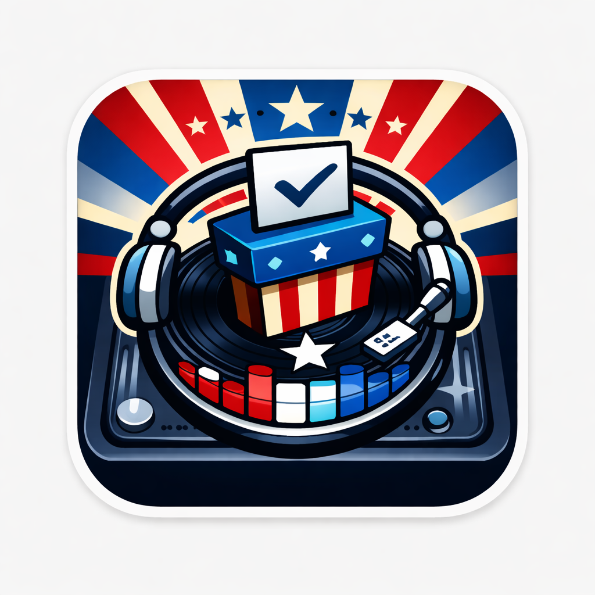

# Democracy DJ

  

**Status:** Prototype (Winter Break 2025)

**Stack:** Swift 6 (iOS), React/TypeScript (Web PoC)

**Architecture:** TCA, Multipeer Connectivity, MusicKit

## The Problem
Road trips with 3 teenagers (Diego, Eduardo, Santiago) result in "Audio Dictatorship"—whoever holds the AUX cable controls the vibe.

## The Solution
A local mesh-network jukebox.
- **The Host (Driver's Phone):** Connected to the car audio via USB. Holds the "Source of Truth" queue.
- **The Guests (Passengers):** Join the session via Multipeer Connectivity (No WiFi/Cellular required). They vote on songs.
- **The Democracy:** Songs are prioritized by vote count.

## Repository Structure
- `/ios` - The Native App (SwiftUI + TCA).
- `/web` - The High-Fidelity Prototype (React + Tailwind). Used to validate voting logic/UI fast.
- `/shared` - Swift Packages / Shared Types.
- `/docs` - Penpot design exports and architecture diagrams.

## Development Workflow
1. **Phase 0 (Web PoC):** Build the "Lobby" and "Voting" UI in React to test the "Game Theory" with the kids.
2. **Phase 1 (Native):** Port the logic to TCA Reducers in `/ios` and implement the Multipeer Actor.

## Getting Started
1. **Web:** `cd web && npm install && npm run dev`
2. **iOS:** Open `ios/DemocracyDJ.xcodeproj` (Requires 2 devices for Mesh testing).
